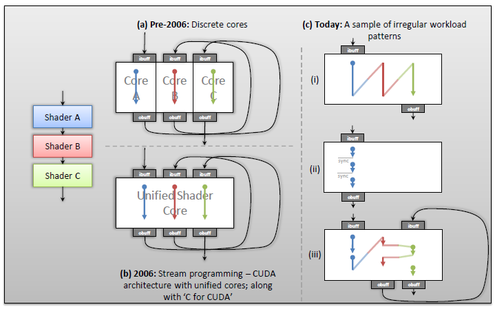
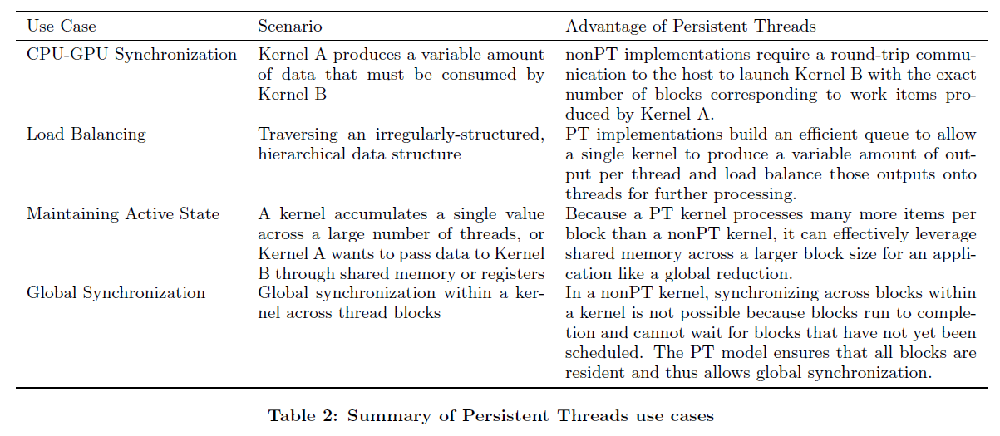

## Learn more about:
* Programmable graphics pipelines like **ray tracing** and **Reyes style rendering**.
* Persisten Threads

## Notes

* The paper was published in 2012 (This is important because both software and hardware changed quite a bit)
* Traditional GPU programming style exposes a significant limitation of the SPMD programming style that neither guarantees **order**, **location** and **timing**, nor does it explicitly allow developers to influence the above three parameters. That's why PT style is used to gain performance by directly controlling scheduling.

### Architecture part
* Pre-2006: Dedicated core for each shader
* 2006: Unified processor architecture. Well-suited for data-parallel **kernels**.

### Workload part
* Multiple kernels within an application to be executed **successively** (without having to write intermediate values to global memory)
* Processing of a single kernel with **synchronization** requirement before the next iteration.
* **Dependent kernels** B and C producing variable work for the next stage to process.

### Traditional Programming Style
* Relies on SIMT and SIMD paradigms.
* Every lane of the physical SM is virtualized into larger batches of threads, which are some **multiple of the SIMD-lane width**, called **warps** or **wavefronts**.
* Each warp operates in **lock-step** and executes the **same instruction**.
* Multiple warps are combined to form a higher abstraction called **thread blocks**.
* Threads within each block allowed to communicate and share data at runtime via **L1 cache/shared memory or registers**.
* Multiple thread blocks being scheduled onto each SM simultaneously, and each block **operating independently**.
* The switching of blocks is managed entirely by a **hardware scheduler**.

### Persistent Threads Programming Style
* The developer’s view is that threads are active for the entire duration of a kernel. (in Non-PT, as blocks run to completion, threads corresponding to these blocks are “retired”, while a batch of threads are “launched” as new blocks are scheduled onto the SM)
1. **Maximal Launch**: A kernel uses at most **as many blocks as can be concurrently scheduled** on the SM. Each thread remains persistent throughout the execution of a kernel until no work remains. All threads a SM can launch is upper bound. Number of threads required to launch a single block is lower bound. These persistent threads are called **thread groups**.
2. **Software schedules work through work queues, not hardware**. The queue can either be static or dynamic and can be used to control the **order**, **location** and **timing**.

