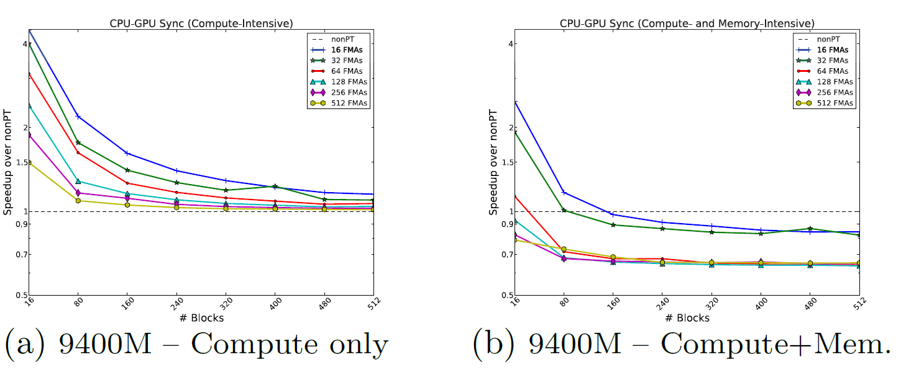
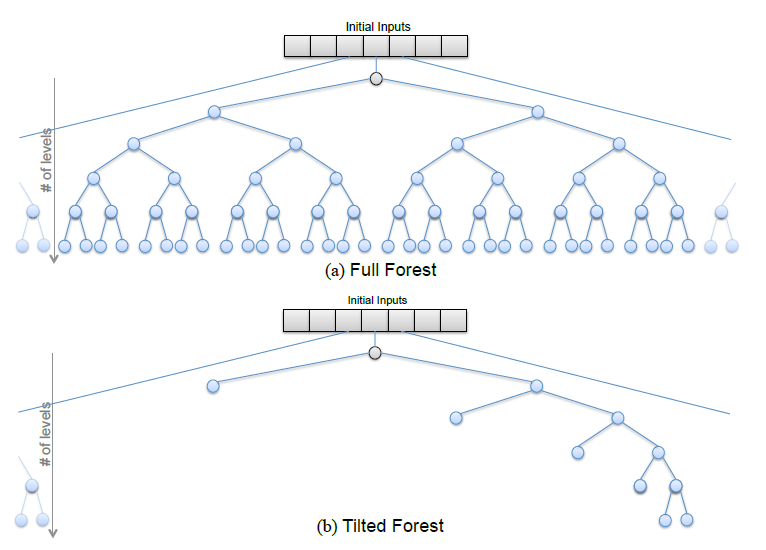
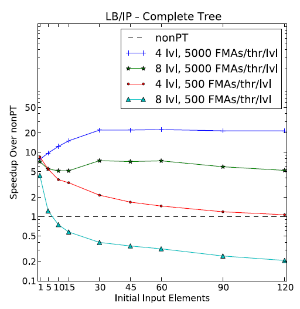
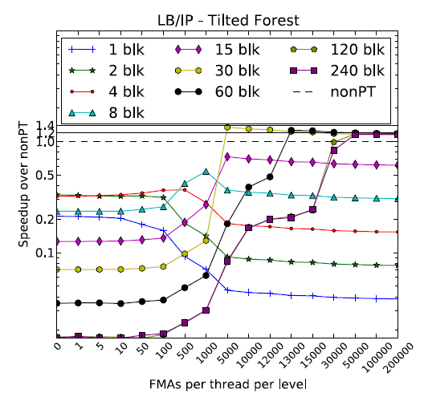

## Learn more about:
* Persistent Threads
* PT-style programming was lacking native hardware and programming API support at the time. Check whether this is still the case.
* Check which core limitations of GPGPU programming mentioned in Section 2.1.1 still a limitation. 

## Notes

* The paper was published in 2012 (This is important because both software and hardware changed quite a bit)
* Traditional GPU programming style exposes a significant limitation of the SPMD programming style that neither guarantees **order**, **location** and **timing**, nor does it explicitly allow developers to influence the above three parameters. That's why PT style is used to gain performance by directly controlling scheduling.

### Architecture part
* Pre-2006: Dedicated core for each shader
* 2006: Unified processor architecture. Well-suited for data-parallel **kernels**.

### Workload part
* Multiple kernels within an application to be executed **successively** (without having to write intermediate values to global memory)
* Processing of a single kernel with **synchronization** requirement before the next iteration.
* **Dependent kernels** B and C producing variable work for the next stage to process.

### Traditional Programming Style
* Relies on SIMT and SIMD paradigms.
* Every lane of the physical SM is virtualized into larger batches of threads, which are some **multiple of the SIMD-lane width**, called **warps** or **wavefronts**.
* Each warp operates in **lock-step** and executes the **same instruction**.
* Multiple warps are combined to form a higher abstraction called **thread blocks**.
* Threads within each block allowed to communicate and share data at runtime via **L1 cache/shared memory or registers**.
* Multiple thread blocks being scheduled onto each SM simultaneously, and each block **operating independently**.
* The switching of blocks is managed entirely by a **hardware scheduler**.

### Persistent Threads Programming Style
* The developer’s view is that threads are active for the **entire duration** of a kernel. (in Non-PT, as blocks run to completion, threads corresponding to these blocks are “retired”, while a batch of threads are “launched” as new blocks are scheduled onto the SM)
1. **Maximal Launch**: A kernel uses at most **as many blocks as can be concurrently scheduled** on the SM. Each thread remains persistent throughout the execution of a kernel until no work remains. All threads a SM can launch is upper bound. Number of threads required to launch a single block is lower bound. These persistent threads are called **thread groups**.
2. **Software schedules work through work queues, not hardware**. The queue can either be static or dynamic and can be used to control the **order**, **location** and **timing**.

## Use Cases
* They perform varying number of fused multiply-add (FMA).
* Implement both PT and non-PT version.
### CPU-GPU Synchronization
* To get sync overhead, they call low-level profiling API of OpenCL. This call provides four items:
1. When a call in the command queue is issued.
2. When a call in the command queue is dispatched to the device execution queue.
3. Time at the beginning of the execution.
4. Time at he end of the execution.

Then, they compute the time between finish time of producer kernel (**GPU-kP**) and start of the consumer kernel (**GPU-kC**).

* As the number of blocks to process increases, the atomic pressure increases and this slows down the PT.
* PT is benefical for small workloads with few memory accesses and small arithmetic intensity.

### Load Balancing

Two issues with non-PT:
-  Vector processor efficiency
-  Handling variable work items being consumed or produced.

They design a test (a forest expansion) that emits a variable amount of work per thread and requires multiple stages to complete.

* The algorithm starts with an initial number of input items. Each thread performs a predefined
amount of FMAs in register space, after which the owning block generates zero, one, or two new items. 
* So, items that generate another item are either roots or intermediate nodes. Items that do not generate work are leaves.
* They experimented with two different forests: 
1. Complete forest: Every input item generates a complete binary tree of a shallow, pre-specified depth 
2. Tilted forest: The **first half** of the items on any given level generate no new items, and every item in the **second half** generates two new items.

* PT outperforms nonPT on **small, irregular work and regular deeply-recursive work**
* PT tends to outperform nonPT when there are not many initial input elements and when the growth in elements is fairly constrained.

### Producer-Consumer Locality
Current hardware allows data sharing by **threads in the same block** via on-chip memory, but **threads in different blocks** must communicate through DRAM and use expensive intrinsics to guarantee coherency.

They use two benchmarks:
1. Large reduce. N float points. Sum all.
2. Synthetic workload of FMAs in two stages. There are N inputs. First stage: perform arithmetic on each item. Second step: perform additional arithmetic on only a certain percentage of those items.

### Global Synchronization
